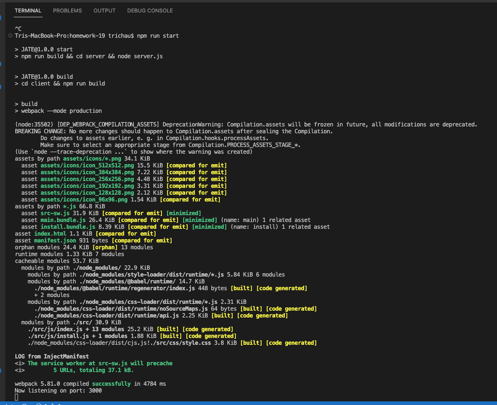
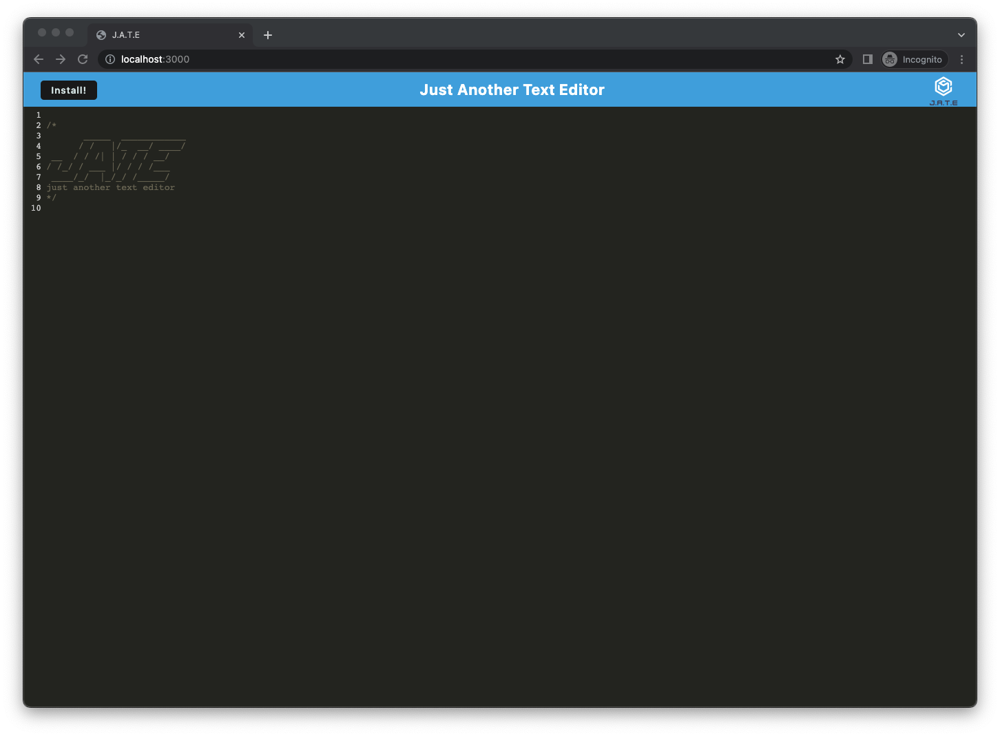

#  Progressive Web Applications (PWA): Text Editor

## Description
The application is a web text editor where the user can create notes or code snippets with or without an internet connection and where the user can reliably retrieve them for later use. The integrated service worker and Cache API's ensure that the application will remain fully functional even without and active internet connection. This application allows the user to access visited pages even if the application is offline.

The URL of the GitHub repository is https://github.com/trichau0206/Text-Editor

## User Story

```md
AS A developer
I WANT to create notes or code snippets with or without an internet connection
SO THAT I can reliably retrieve them for later use
```

## Installation
 The package.json will be generated and will contains all the details of the application in which the user have inputted during the npm initialization.
```md
   npm install express (express.js)
   npm install --save-dev webpack (Webpack)
   npm install webpack-dev-server --save-dev (webpack-dev-server)
   npm install --save-dev webpack-pwa-manifest (WebpackPwaManifest)
   npm install babel (Babel)
   npm install --save-dev css-loader (CSS-loader)
   npm install concurrently --save (run multiple commands concurrently.) (Concurrently)
   npm npm install idb (IndexedDB)
```

```
npm run start
```


App will be listened on locallhotst:3000


